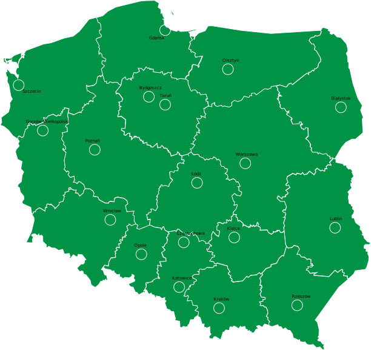

# POLANDGO.v.01
<!DOCTYPE html>
<html>
<head>
    <meta http-equiv="content-type" content="text/html; charset=utf-8" />
    <link rel="stylesheet" href="style.css">
<title>TEST MAPA</title>
    
    
    
</head>
<body>

    

        <ul>

            
            <li><a class="napis" href="index.html">Strona Główna</a></li>
            <li><a class="napis" href="#">Informacje</a></li>

            <li>

                <button class="dropbtn">Polecane</button>
                

                    <a class="zima" href="#">Zima</a>
                    <a class="wiosna" href="#">Wiosna</a>
                    <a class="lato" href="#">Lato</a>
                    <a class="jesien" href="#">Jesień</a>
                

            

            <li><a class="napis" href="#">Kontakt</a></li>
        </ul>
    

    

    <map name="simple">
        <area shape="circle" coords="907,573,31" href="/torun/torun.html" />
        <area shape="circle" coords="817,530,31" href="/bydgoszcz/bydgoszcz.html" />
        <area shape="circle" coords="102,466,31" href="sczecin/szczecin.html" />
        <area shape="circle" coords="907,164,31" href="gdansk/gdansk.html" />
        <area shape="circle" coords="1252,379,31" href="olsztyn/olsztyn.html" />
        <area shape="circle" coords="1872,588,31" href="bialystok/bialystok.html" />
        <area shape="circle" coords="1082,1002,31" href="lodz/lodz.html" />
        <area shape="circle" coords="606,1206,31" href="wroclaw/Wrocław.html" />
        <area shape="circle" coords="1347,896,31" href="warszawa/warszawa.html" />
        <area shape="circle" coords="1840,1250,31" href="lublin/lublin.html" />
        <area shape="circle" coords="776,1395,31" href="/opole/opole.html" />
        <area shape="circle" coords="520,821,31" href="/poznan/poznan.html" />
        <area shape="circle" coords="235,716,31" href="/gorzow/gorzow.html" />
        <area shape="circle" coords="1009,1330,31" href="/czestochowa/czestochowa.html" />
        <area shape="circle" coords="984,1575,31" href="/katowice/katowice.html" />
        <area shape="circle" coords="1286,1303,31" href="/kielce/kielce.html" />
        <area shape="circle" coords="1203,1691,31" href="/krakow/krakow.html" />
        <area shape="circle" coords="1632,1676,31" href="/rzeszow/rzeszow.html" />

    </map>

    
POLANDGO.pl sp. z o.o. z siedzibą w XYZ, przy ul. XYZ, bud D, xx-xxx XYZ zarejestrowana w Rejestrze Przedsiębiorców Krajowego Rejestru Sądowego prowadzonym przez Sąd Rejonowy dla m. st. Warszawy w Warszawie, XIII Wydział Gospodarczy Krajowego Rejestru Sądowego, pod numerem 0000412352, NIP 1132853869, REGON 146025969 i z kapitałem zakładowym w wysokości 18 134 050,00 zł.

</body>

</html>
